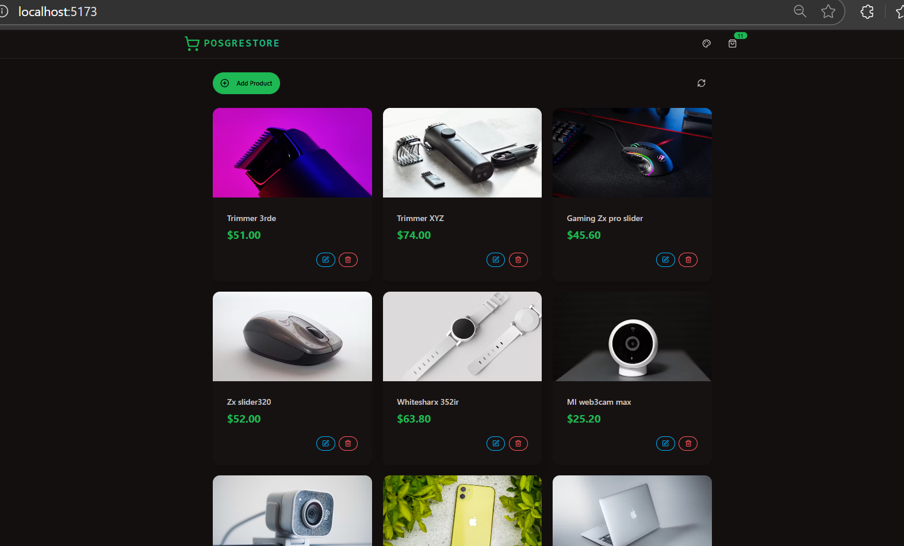
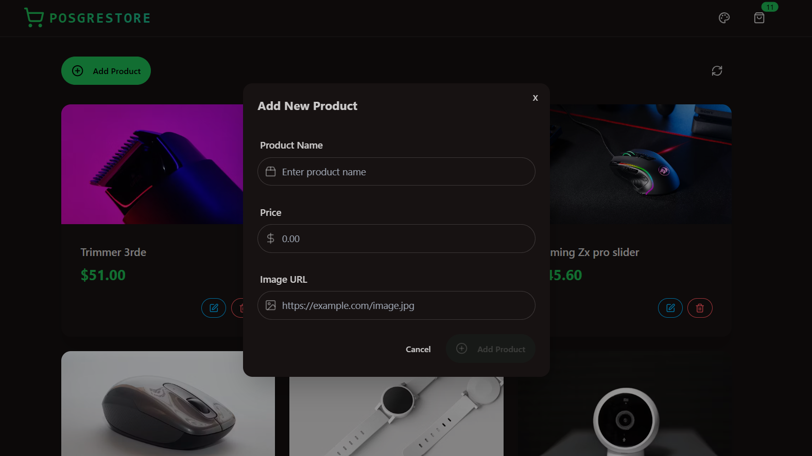
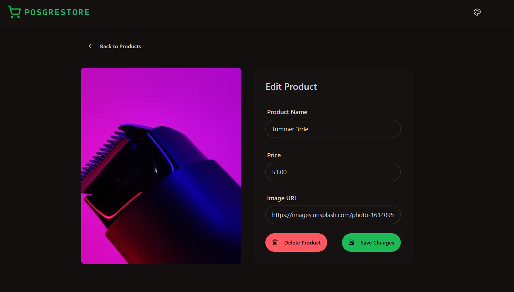
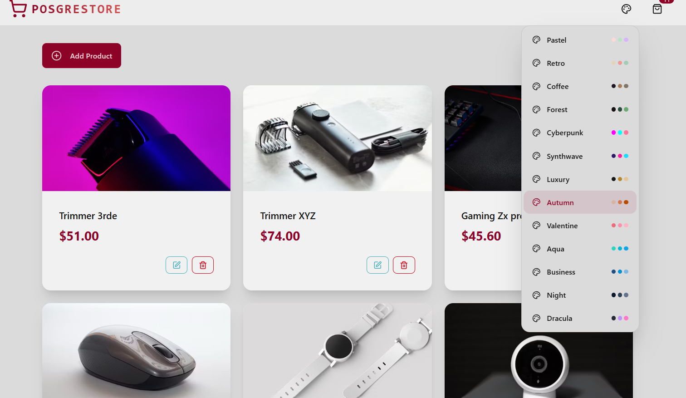

# 🛍️ Product Store with Postgres & React

A modern, full-stack PERN (PostgreSQL, Express, React, Node.js) e-commerce application with advanced security features, elegant UI design, and seamless user experience.

LINK TO WEBSITE-> https://product-store-with-postgres-react-ax5i.onrender.com



## ✨ Features

### 🚀 **Tech Stack**
- **Frontend**: React 18 + Vite
- **Backend**: Node.js + Express.js
- **Database**: PostgreSQL (Neon Database)
- **Styling**: TailwindCSS + DaisyUI
- **State Management**: Zustand
- **Security**: Arcjet (Rate Limiting & Bot Detection)
- **Icons**: Lucide React
- **Notifications**: React Hot Toast
- **Routing**: React Router DOM

### 🔒 **Security Features**
- **Rate Limiting**: Token bucket algorithm with 30 requests per 5-second interval
- **Bot Detection**: Blocks malicious bots while allowing search engines
- **Security Headers**: Helmet.js for HTTP security headers
- **SQL Injection Protection**: Parameterized queries with tagged template literals
- **CORS Protection**: Cross-origin resource sharing configuration

### 🎨 **UI/UX Features**
- **Multiple Themes**: 13 beautiful DaisyUI themes (Pastel, Retro, Cyberpunk, etc.)
- **Responsive Design**: Mobile-first approach with Tailwind CSS
- **Modern Icons**: Lucide React icon library
- **Toast Notifications**: Real-time user feedback
- **Loading States**: Smooth loading indicators
- **Error Handling**: Comprehensive client & server error management

### 📦 **Product Management**
- **CRUD Operations**: Create, Read, Update, Delete products
- **Image Support**: URL-based product images
- **Real-time Updates**: Instant UI updates with optimistic rendering
- **Form Validation**: Client-side validation with error feedback
- **Inventory Tracking**: Product count display in navigation

## 🚀 Getting Started

### Prerequisites
- Node.js (v16 or higher)
- PostgreSQL database (Neon Database recommended)
- Arcjet API key for security features

### Installation

1. **Clone the repository**
   ```bash
   git clone https://github.com/talrejasahil4994/Product-Store-with-Postgres-React.git
   cd Product-Store-with-Postgres-React
   ```

2. **Install dependencies**
   ```bash
   # Install root dependencies
   npm install
   
   # Install frontend dependencies
   cd frontend
   npm install
   cd ..
   ```

3. **Environment Setup**
   Create a `.env` file in the root directory:
   ```env
   # Database Configuration (Neon Database)
   PGHOST=your_neon_host
   PGDATABASE=your_database_name
   PGUSER=your_username
   PGPASSWORD=your_password
   
   # Arcjet Security
   ARCJET_KEY=your_arcjet_api_key
   
   # Server Configuration
   PORT=3000
   NODE_ENV=development
   ```

4. **Start the application**
   ```bash
   # Development mode (runs both frontend and backend)
   npm run dev
   
   # Or start backend only
   npm start
   ```

5. **Frontend Development Server**
   ```bash
   cd frontend
   npm run dev
   ```

## 📁 Project Structure

```
Product-Store-with-Postgres-React/
├── backend/
│   ├── config/
│   │   └── db.js                 # Database configuration
│   ├── controllers/
│   │   └── productController.js  # Product CRUD operations
│   ├── lib/
│   │   └── arcjet.js            # Security configuration
│   ├── routes/
│   │   └── productRoutes.js     # API routes
│   ├── seeds/                   # Database seeders
│   └── server.js               # Express server setup
├── frontend/
│   ├── src/
│   │   ├── components/
│   │   │   ├── AddProductModal.jsx
│   │   │   ├── Navbar.jsx
│   │   │   ├── ProductCard.jsx
│   │   │   └── ThemeSelector.jsx
│   │   ├── pages/
│   │   │   ├── HomePage.jsx
│   │   │   └── ProductPage.jsx
│   │   ├── store/
│   │   │   ├── useProductStore.js  # Zustand state management
│   │   │   └── useThemeStore.js
│   │   ├── App.jsx
│   │   └── main.jsx
│   ├── tailwind.config.js      # Tailwind + DaisyUI config
│   └── vite.config.js         # Vite configuration
└── package.json               # Root package configuration
```

## 🎯 API Endpoints

### Products API
- `GET /api/products` - Fetch all products
- `GET /api/products/:id` - Fetch single product
- `POST /api/products` - Create new product
- `PUT /api/products/:id` - Update product
- `DELETE /api/products/:id` - Delete product

### Request/Response Format
```json
{
  "success": true,
  "data": {
    "id": 1,
    "name": "Product Name",
    "price": "29.99",
    "image": "https://example.com/image.jpg",
    "created_at": "2024-01-01T00:00:00.000Z"
  }
}
```

## 🎨 UI Components

### Homepage Interface


The homepage features:
- **Navigation Bar**: Logo, theme selector, and product count
- **Product Grid**: Responsive card layout
- **Add Product Button**: Quick access to product creation
- **Empty State**: Friendly message when no products exist

### Add Product Modal


Modal features:
- **Form Validation**: Required field validation
- **Icon Integration**: Visual form field indicators
- **Loading States**: Button feedback during submission
- **Error Handling**: Toast notifications for errors

### Product Edit Page


### Themes DropDown


Edit page includes:
- **Image Preview**: Live preview of product image
- **Form Pre-population**: Auto-filled with existing data
- **Action Buttons**: Save changes and delete product
- **Navigation**: Back to homepage functionality

## 🔧 Configuration

### Database Schema
```sql
CREATE TABLE IF NOT EXISTS products (
  id SERIAL PRIMARY KEY,
  name VARCHAR(255) NOT NULL,
  image VARCHAR(255) NOT NULL,
  price DECIMAL(10, 2) NOT NULL,
  created_at TIMESTAMP DEFAULT CURRENT_TIMESTAMP
);
```

### Arcjet Security Rules
- **Shield Protection**: SQL injection, XSS, CSRF protection
- **Bot Detection**: Blocks malicious bots, allows search engines
- **Rate Limiting**: Token bucket with 20 capacity, 30/5s refill rate

### DaisyUI Themes
Available themes: `pastel`, `retro`, `coffee`, `forest`, `cyberpunk`, `synthwave`, `luxury`, `autumn`, `valentine`, `aqua`, `business`, `night`, `dracula`

## 🚀 Deployment

### Build for Production
```bash
npm run build
```

### Environment Variables for Production
```env
NODE_ENV=production
PGHOST=your_production_host
PGDATABASE=your_production_db
PGUSER=your_production_user
PGPASSWORD=your_production_password
ARCJET_KEY=your_production_arcjet_key
```

### Deployment Platforms
- **Vercel**: Recommended for frontend
- **Railway/Render**: Great for full-stack deployment
- **Neon Database**: Serverless PostgreSQL
- **Netlify**: Alternative frontend hosting

## 🤝 Contributing

1. Fork the repository
2. Create your feature branch (`git checkout -b feature/AmazingFeature`)
3. Commit your changes (`git commit -m 'Add some AmazingFeature'`)
4. Push to the branch (`git push origin feature/AmazingFeature`)
5. Open a Pull Request

## 📝 License

This project is licensed under the ISC License - see the package.json file for details.

## 🙏 Acknowledgments

- **Neon Database** - Serverless PostgreSQL
- **Arcjet** - Security and rate limiting
- **DaisyUI** - Beautiful Tailwind CSS components
- **Lucide** - Modern icon library
- **Zustand** - Lightweight state management

## 📞 Support

If you have any questions or need help, please open an issue on GitHub.

---

**Made with ❤️ by Sahil Talreja**
